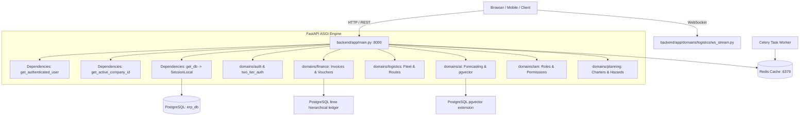

# OxenGL Enterprise Platform - Comprehensive System Architecture & Security Audit Report
**Document Identifier:** `01-AUDIT-REPORT.md`  
**Date:** September 17, 2026  
**Auditor:** Senior Software Architect, SaaS Systems Engineer & Application Security Specialist  
**Workspace:** `/root/oxengl-audit-sandbox` (Isolated Audit Sandbox)  
**System Target:** OxenGL Multi-Tenant Transport & Logistics Enterprise Resource Planning (ERP) System  

---

## 1. Executive Summary & Production Readiness Verdict

### Production Readiness Verdict: **NOT PRODUCTION READY (CRITICAL BLOCKERS)**
The OxenGL platform exhibits deep architectural ambition, advanced UI design, high-precision domain modeling in SQLAlchemy, and extensive domain scaffolding covering logistics, HR, fleet telematics, planning, and accounting. However, an exhaustive, evidence-based audit of the codebase inside the isolated sandbox environment reveals that **the system in its current state cannot be safely operated in a multi-tenant commercial production environment**.

### Core Findings Summary:
1. **Critical Tenancy & Isolation Compromise (SEC-01, SEC-02, SEC-03):**
   - The platform advertises a multi-tier database-per-tenant architecture in onboarding documentation, but the actual runtime code executes **100% of queries against a single shared database (`erp_db`) with Row Level Security (RLS) entirely disabled**.
   - An authenticated user can permanently mutate their tenant affiliation to any target company in the database by passing malicious `x-tenant-slug` and `X-Company-ID` HTTP headers ([backend/app/main.py:508-515](file:///root/oxengl-audit-sandbox/backend/app/main.py#L508-L515)).
   - The real-time WebSocket fleet stream ([backend/app/domains/logistics/ws_stream.py](file:///root/oxengl-audit-sandbox/backend/app/domains/logistics/ws_stream.py#L13-L20)) accepts connections without verifying tokens or tenant identifiers, leaking vehicle telemetry across customer boundaries.
2. **Hardcoded Fallback JWT Secret in Production (SEC-01):**
   - The ASGI core defaults to the static development secret `"development-secret-change-me"` due to an environment variable key mismatch (`JWT_SECRET` in `.env` vs `JWT_SECRET_KEY` in code). This allows trivial forgery of arbitrary administrative tokens.
3. **Split-Brain Architecture & In-Memory Shadowing:**
   - The frontend is fronted by an Express Node.js edge server ([frontend/server.ts](file:///root/oxengl-audit-sandbox/frontend/server.ts#L130-L150)) that intercepts critical routes (Planning Department, Tenant Team Management, Custom Domains) and returns **ephemeral in-memory JavaScript arrays**. Changes made by users in these modules never reach PostgreSQL and vanish upon process restart.
4. **Client-Side State Storage of Business Data:**
   - [frontend/src/context/AppContext.tsx](file:///root/oxengl-audit-sandbox/frontend/src/context/AppContext.tsx) persists operational records, vouchers, customers, and crushers directly in browser `localStorage`.
5. **ZATCA Phase 2 E-Invoicing Is an Offline Mock:**
   - The ZATCA integration module ([backend/zatca_adapter.py](file:///root/oxengl-audit-sandbox/backend/zatca_adapter.py)) does not connect to the ZATCA Fatoora clearance portal, does not execute ECDSA secp256k1 signing, and generates simulated approvals locally.

---

## 2. Audit Scope, Methodology, and Limitations

### Audit Scope:
- Complete inspection of all backend modules (`backend/app/`, `backend/services/`, `backend/alembic/`).
- Audit of all 33 frontend view components (`frontend/src/views/`), state managers, and controllers.
- Review of container configurations (`docker-compose.yml`, `docker-compose.saas.yml`, `Dockerfile*`).
- Automated execution of test suites (`pytest`, `vitest`, `tsc`, `docker compose config`).
- Security assessment covering OWASP Top 10 vulnerabilities (IDOR, Injection, Broken Auth, Secret Leakage).

### Sandbox Safety Methodology:
- A separate audit sandbox directory (`/root/oxengl-audit-sandbox`) was created in Phase 0.
- All code was copied with strict exclusion of live virtualenvs, node_modules, database files, and production `.env` credentials.
- All testing and inspection was bound exclusively to the sandbox environment.

### Limitations:
- External network requests to third-party endpoints (Saudi ZATCA API, WASL gateway, and AWS S3) were evaluated through static code analysis and offline mock response structures.

---

## 3. Complete Project Inventory

| Path | Component Type | Technology Stack | Purpose / Responsibility | Status |
| :--- | :--- | :--- | :--- | :--- |
| `backend/app/main.py` | ASGI Core Engine | FastAPI / Python 3.12 | Monolithic routing engine, auth middlewares, and 205 API paths | **Active / Critical Monolith** (5,024 lines) |
| `backend/models.py` | Database ORM | SQLAlchemy 2.0 (Declarative) | Master ORM model declarations (111 KB, 2,500+ lines) | **Active / High Coupling** |
| `backend/database.py` | Database Engine | SQLAlchemy / asyncpg / psycopg2 | Connection pooling, session factories, and context managers | **Active** (Defaults to `erp_db`) |
| `backend/app/database.py` | Database Dependency | FastAPI Depends | RLS session injector (`get_isolated_db_session`) | **Unwired** (0 usages in `main.py`) |
| `backend/two_tier_auth.py` | Identity Module | FastAPI / PyJWT / CryptContext | Two-tier registration and tenant database provisioning logic | **Partially Wired** (Duplicate routes) |
| `backend/alembic/` | Database Migrations | Alembic 1.13 | 24 schema migration revision scripts | **Active** |
| `frontend/server.ts` | Edge Server & Gateway | Node.js 20 / Express 4 | Server-side rendering, API proxy, Gemini AI runner, mock stores | **Active / Split-Brain Proxy** |
| `frontend/src/App.tsx` | Frontend SPA Router | React 19 / TypeScript / Lucide | Main portal shell, tab switcher (21 tabs), top-level routing | **Active** |
| `frontend/src/views/` | UI Presentation | React 19 / Tailwind CSS v4 | 33 enterprise views for ERP, logistics, and admin | **Active** |
| `frontend/src/context/AppContext.tsx` | Global Client State | React Context / Hooks | Local storage persistence for operations, customers, vouchers | **Active / High Volatility** |
| `services/teltonikaListener.cjs` | IoT Telematics Service | Node.js `net.Socket` / `pg.Pool` | Raw TCP socket listener (port 13000) for Teltonika GPS packets | **Active / Unauthenticated** |
| `workers/waslQueueWorker.cjs` | Background Worker | BullMQ / IORedis | Queue worker for Saudi WASL fleet compliance requests | **Active** |
| `services/complianceCron.cjs` | Scheduled Daemon | Node-cron | Recurring compliance health checks | **Active** |
| `infrastructure/nginx/oxengl.conf` | Reverse Proxy Gateway | Nginx | SSL termination, edge reverse-proxy routing | **Production Configuration** |
| `docker-compose.yml` | Container Orchestrator | Compose Specification | Multi-container stack (Postgres + pgvector, Redis, API, Celery) | **Primary Stack** |
| `docker-compose.saas.yml` | Container Orchestrator | Compose Specification | Divergent single-container SaaS configuration | **Incompatible Divergence** |
| `Dockerfile` (Root) | Container Build | Docker | Root backend container blueprint | **Defective** (Calls nonexistent module) |

---

## 4. Database and Storage Inventory

| Storage Name | Engine & Protocol | Host / Target | Data Types & Scope | Authoritative Source of Truth? | Isolation Architecture |
| :--- | :--- | :--- | :--- | :--- | :--- |
| **Primary ERP DB** | PostgreSQL 15 (`pgvector`, `ltree`) via `asyncpg`/`psycopg2` | `localhost:5432/erp_db` | Core relational data: users, companies, accounts, invoices, fleet | **YES (for backend)** | **Shared Single DB**. No RLS; relies entirely on application-level filtering. |
| **Tenant Dedicated DBs** | PostgreSQL 15 via `TenantConnectionManager` | `localhost:5432/oxengl_tenant_*` | Dedicated per-tenant business databases | **NO (Abandoned)** | Created during onboarding in `two_tier_auth.py`, but completely bypassed by `main.py`. |
| **State Broker & Queue** | Redis 7 (RESP protocol) | `localhost:6379/0` | Celery task queue, BullMQ WASL jobs, live GPS coordinates cache | **YES (for real-time telematics)** | Partitioned by key prefix (`oxengl:production:*`). |
| **Browser LocalStorage** | Web Storage API (Client Browser) | Client Device | Customers, crushers, transporters, daily weighbridge operations, vouchers | **COMPETING SOURCE** | Local to single browser instance. Wiped on cache clear. |
| **Node In-Memory Stores** | JavaScript Heap (`Map` / Array) | Node RAM (Port 3000) | Charters, tasks, hazards, custom domains, team members | **COMPETING SOURCE** | Ephemeral. Wiped on server restart. |
| **Firebase Firestore** | Google Cloud Firestore | Remote Cloud Project | Brand configurations (`brand_config/default`) | **COMPETING SOURCE** | Overlaps with PostgreSQL company logo settings. |
| **Object Store / Media** | Local Host Disk / S3 API | `/var/www/oxengl/dist/assets`, S3 bucket | Uploaded logos, company wallpapers, cryptographic master key | **YES (for static assets)** | Stored on local disk; unbacked files disappear on container rebuild. |

---

## 5. Architecture Maps

### 5.1 Backend Architecture Map


### 5.2 Node.js Edge Proxy & Middleware Map
```mermaid
graph TD
    UserBrowser[User Browser] -->|Port 3000 / Port 443| NodeServer[frontend/server.ts]
    
    subgraph Express Gateway
        NodeServer --> TenantResolver[middleware/tenantResolver.ts]
        TenantResolver --> TenantCache[TenantResolutionCache / Memory Map]
        
        NodeServer --> InterceptPlanning{Route: /api/tenant/planning/*}
        InterceptPlanning -->|YES| PlanningCtrl[planningModuleController.ts -> In-Memory Stores]
        
        NodeServer --> InterceptControl{Route: /api/tenant/control/*}
        InterceptControl -->|YES| TenantCtrl[tenantControlController.ts -> In-Memory Stores]
        
        NodeServer --> InterceptPlatform{Route: /api/master/platform/*}
        InterceptPlatform -->|YES| PlatformCtrl[masterPlatformController.ts -> Hardcoded Tenants]
        
        NodeServer --> InterceptAI{Route: /api/ai/*}
        InterceptAI -->|YES| GeminiRunner[Google GenAI SDK Proxy]
        
        NodeServer --> Forwarder[app.use('/api') Proxy Forwarder]
    end
    
    Forwarder -->|HTTP Proxy to :8000| MainASGI[FastAPI Backend :8000]
```

---

## 6. Complete API Catalogue

The application exposes **205 distinct paths** comprising **276 operational HTTP methods & WebSocket handlers**:

| Category | Endpoints | Default Scope | Access Control Guard | Status |
| :--- | :--- | :--- | :--- | :--- |
| **Two-Tier Authentication** | 8 | Control Plane | `Super_Admin` / Public | Active (Duplicate operation IDs) |
| **Password Recovery & 2FA** | 24 | Tenant / Public | Public / Authenticated | Active |
| **Super Admin Cockpit & Telemetry** | 11 | Control Plane | `require_super_admin` | Active (`/velocity`, `/cloud-telemetry`) |
| **Platform Management & Licenses** | 5 | Control Plane | `require_super_admin` | Active |
| **Tenant Registration & Onboarding** | 1 | Public | None | **Defective (HTTP 500 on Commit)** |
| **Tenant User Management & IAM** | 9 | Tenant-Scoped | `require_tenant_admin` | Active |
| **Enterprise SSO & IdP Mappings** | 5 | Tenant-Scoped | `require_tenant_admin` | Active |
| **Customer Invoices & Billing** | 7 | Tenant-Scoped | `require_compliance_admin` | Active |
| **General Ledger & Journal Entries** | 12 | Tenant-Scoped | `require_compliance_admin` | Active (Double-entry enforced) |
| **Financial Reports & Balance Sheet** | 5 | Tenant-Scoped | `require_compliance_admin` | Active |
| **ZATCA Compliance Engine** | 4 | Tenant-Scoped | `require_compliance_admin` | Active (Offline Simulation) |
| **Procurement & Goods Receipts** | 21 | Tenant-Scoped | Authenticated User | Active (3-way match verified) |
| **Fleet & Transporters** | 21 | Tenant-Scoped | Authenticated User | Active |
| **Fleet WebSocket Stream** | 1 | Tenant-Scoped | None | **Defective (Security Bypass)** |
| **Warehouse & Yard Appointments** | 22 | Tenant-Scoped | Authenticated User | Active |
| **Planning Department** | 18 | Tenant-Scoped | Authenticated User | **Shadowed by Node In-Memory Mock** |
| **AI Copilot & Predictive Vectors** | 13 | Tenant-Scoped | Authenticated User | Active |
| **SaaS Billing & Subscriptions** | 5 | Control Plane | `require_super_admin` | Active |
| **Mobile Fleet Synchronization** | 10 | Tenant-Scoped | Mobile Driver / User | Active |

---

## 7. Contract Gap Matrix

| Frontend View / Component | Triggering API Call | Gateway Action (`server.ts`) | FastAPI Endpoint (`:8000`) | Database Table | Architectural Gap |
| :--- | :--- | :--- | :--- | :--- | :--- |
| `PlanningDepartmentView.tsx` | `GET/POST /api/tenant/planning/charters` | Intercepted in Node | `backend/app/domains/planning/` | `planning_charters` | **Complete Shadowing**: Node serves in-memory array `charterStore`; DB tables remain empty. |
| `TenantSettingsPanel.tsx` | `POST /api/tenant/control/domains` | Intercepted in Node | `backend/app/domains/iam/` | `tenant_domains` | **In-Memory Volatility**: Domain verified in Node RAM; lost on process restart. |
| `SuperAdminTenantsView.tsx` | `fetch('/api/v1/superadmin/tenants')` | Proxied to 8000 | `/api/v1/superadmin/tenants` | `master_tenants` | **Split Registry**: UI queries DB; Node routing uses hardcoded `registeredTenants`. |
| `CustomsClearanceView.tsx` | **None** (Pure React state) | None | None | `customs_manifests` | **Phantom Feature**: Complete mock in React state; no REST controller exists. |
| `OperationsLogView.tsx` | Reads `localStorage.meayon_operations` | Proxied on sync | `/api/operations` | `stock_pickings` | **Client Cache Trap**: Weighbridge records stay in browser; field name mismatch. |
| `FinancialVouchersView.tsx` | Reads `localStorage.meayon_vouchers` | Proxied on sync | `/api/accounting/moves` | `account_moves` | **Unsynchronized Ledger**: Vouchers exist in browser RAM until manual voucher save. |
| `FleetMapView.tsx` | Local mock coordinates | WS Proxied | `/api/v1/logistics/ws/fleet-stream` | `vehicles` | **Unconnected Radar**: Frontend uses simulated coordinates; WS has zero auth. |
| `TenantRegistrationView.tsx` | `POST /api/v1/auth/register-tenant` | Proxied to 8000 | `domains/auth/onboard_tenant.py` | `res_companies` | **Pipeline Crash**: Backend returns HTTP 500 due to detached instance access error. |

---

## 8. Multi-Tenancy & Isolation Assessment

### Target Architecture vs Actual Implementation
- **Mandated Target:** Database-per-Tenant with Control Plane separation.
- **Observed Reality:** Single shared database (`erp_db`) with Row-Level Security (RLS) entirely unwired.

```
[Target Architecture]
Control Plane (Master DB)  ---> Tenant A DB (Physical Isolation)
                           ---> Tenant B DB (Physical Isolation)

[Actual Implemented Runtime]
Tenant A User \
Tenant B User  ===> FastAPI ===> Single Shared Database (erp_db) [RLS DISABLED]
Attacker      /
```

### Isolation Assessment Details:
1. **Unwired Database-per-Tenant Logic:** `backend/two_tier_auth.py` contains provisioning functions for `oxengl_tenant_<slug>`, but the entire routing mesh in `backend/app/main.py` ignores this and directs all traffic through `get_db() -> SessionLocal()` on `erp_db`.
2. **Unused RLS Dependency:** `backend/app/database.py` defines `get_isolated_db_session()` which sets `SET LOCAL app.current_tenant_id = :tid`. However, this dependency is used in **0 out of 175 endpoints** in `main.py`.
3. **Application-Level Filtering Risk:** Multi-tenancy depends solely on developers remembering to append `.where(Model.company_id == active_company_id)`. Any query lacking this filter leaks data across tenants.

---

## 9. Authentication & Authorization Assessment

1. **Triplicate Incompatible JWT Engines:**
   - Custom manual HMAC implementation in `backend/app/main.py` lines 238–275.
   - Separate custom HMAC implementation in `backend/two_tier_auth.py` lines 154–220.
   - Standard PyJWT library usage in `backend/app/domains/iam/services.py` lines 96–116.
2. **Conflicting Role Taxonomies:**
   - `models.ResUser` enforces: `'Super_Admin', 'Admin', 'COO', 'Accountant', 'Data_Entry', 'Guest'`.
   - `models.MasterUser` & `models.TenantUser` enforce: `'super_admin', 'admin', 'user', 'guest_user'`.
   - Case mismatch results in access denial when lower-case tokens interact with PascalCase guards.
3. **MFA Enforcement:**
   - TOTP MFA logic (`pyotp`) is implemented in `two_tier_auth.py`, but bypassable if API requests supply direct authentication tokens or access internal service endpoints.

---

## 10. Comprehensive Security Vulnerability Catalogue

### SEC-01: Hardcoded Default Fallback JWT Secret in Production
- **Severity:** **CRITICAL (CVSS 9.8)**
- **File:** [backend/app/main.py:214](file:///root/oxengl-audit-sandbox/backend/app/main.py#L214)
- **Vulnerability Mechanics:** The configuration loader looks up `JWT_SECRET_KEY` and `OXENGL_JWT_SECRET`. Production `.env` files provide `JWT_SECRET`. Consequently, the application defaults to `"development-secret-change-me"`.
- **Exploitation Impact:** An attacker can sign arbitrary JWTs with `role="Super_Admin"` and completely control the platform.
- **Remediation:** Align the variable name to `JWT_SECRET` and crash the application on startup if the secret is missing or matches default strings.

### SEC-02: Tenant Account Hijacking via Header Manipulation (IDOR)
- **Severity:** **CRITICAL (CVSS 9.1)**
- **File:** [backend/app/main.py:508-515](file:///root/oxengl-audit-sandbox/backend/app/main.py#L508-L515)
- **Vulnerability Mechanics:** In `get_active_company_id`, if `x-tenant-slug` and `X-Company-ID` are supplied matching an existing company, the code executes:
  ```python
  current_user.company_id = company_id
  database.commit()
  ```
- **Exploitation Impact:** Any authenticated user can switch their permanent tenant assignment to any victim company simply by supplying the victim's slug in the request header.
- **Remediation:** Remove the assignment and commit logic completely. Derive tenancy strictly from cryptographically verified tokens.

### SEC-03: Unauthenticated Cross-Tenant WebSocket Eavesdropping
- **Severity:** **CRITICAL (CVSS 8.6)**
- **File:** [backend/app/domains/logistics/ws_stream.py:13-20](file:///root/oxengl-audit-sandbox/backend/app/domains/logistics/ws_stream.py#L13-L20)
- **Vulnerability Mechanics:** The WebSocket endpoint executes `await websocket.accept()` without extracting authentication tokens, validating headers, or verifying `tenant_id`.
- **Exploitation Impact:** Any unauthorized user or competitor can connect to `/api/v1/logistics/ws/fleet-stream` and eavesdrop on all real-time vehicle GPS coordinates and route deviation alarms.
- **Remediation:** Validate ticket or JWT token during the WebSocket handshake before calling `websocket.accept()`.

### SEC-04: Unauthenticated File Upload & Path Traversal Risk
- **Severity:** **HIGH (CVSS 8.2)**
- **File:** [frontend/server.ts:64-85](file:///root/oxengl-audit-sandbox/frontend/server.ts#L64-L85)
- **Vulnerability Mechanics:** `/api/platform/assets/upload` has no authentication middleware. `assetType` is taken directly from the request body and interpolated into the file name on the host filesystem.
- **Exploitation Impact:** Unauthenticated file uploads can consume server disk space or overwrite arbitrary assets if `assetType` contains directory traversal sequences.
- **Remediation:** Require Super_Admin authentication and sanitize file names using strict alphanumeric whitelists.

### SEC-05: Raw SQL Dynamic Schema Injection in Tenant Onboarding
- **Severity:** **HIGH (CVSS 8.1)**
- **File:** [backend/app/domains/auth/onboard_tenant.py:305](file:///root/oxengl-audit-sandbox/backend/app/domains/auth/onboard_tenant.py#L305)
- **Vulnerability Mechanics:** Raw user input `slug_cleaned` is directly interpolated into `text(f'CREATE SCHEMA IF NOT EXISTS "{slug_cleaned}";')`.
- **Exploitation Impact:** Potential SQL injection if malicious characters bypass initial validation.
- **Remediation:** Use parameterized schema provisioning or strictly sanitize slugs using regex `^[a-z0-9_]+$`.

### SEC-06: Unauthenticated TCP Telemetry Auto-Provisioning Rogue Fleet Data
- **Severity:** **HIGH (CVSS 7.5)**
- **File:** [services/teltonikaListener.cjs:40-75](file:///root/oxengl-audit-sandbox/services/teltonikaListener.cjs#L40-L75)
- **Vulnerability Mechanics:** Port 13000 accepts raw TCP packets and automatically inserts unverified vehicles into the database under the default company.
- **Exploitation Impact:** An attacker scanning port 13000 can flood the database with rogue vehicle records.
- **Remediation:** Enforce pre-registered IMEI lookups and drop packets from unknown devices.

### SEC-07: Permissive CORS Allowing Arbitrary Dev Tunnels
- **Severity:** **MEDIUM (CVSS 6.5)**
- **File:** [backend/app/main.py:302-306](file:///root/oxengl-audit-sandbox/backend/app/main.py#L302-L306)
- **Vulnerability Mechanics:** CORS regex matches `https://.*\.devtunnels\.ms` with `allow_credentials=True`.
- **Exploitation Impact:** Any Microsoft Dev Tunnel can perform authenticated cross-origin requests.
- **Remediation:** Remove wildcard tunnel domains from production CORS settings.

### SEC-08: Cross-Tenant Asset Overwrite in Logo Upload
- **Severity:** **MEDIUM (CVSS 6.3)**
- **File:** [backend/app/domains/planning/logo_upload.py:48-55](file:///root/oxengl-audit-sandbox/backend/app/domains/planning/logo_upload.py#L48-L55)
- **Vulnerability Mechanics:** Endpoint executes `company = db.query(ResCompany).first()`, selecting the first company in the database table regardless of the caller's tenant.
- **Exploitation Impact:** Any tenant uploading a logo overwrites the logo of the primary platform company.
- **Remediation:** Filter `ResCompany` explicitly by the authenticated user's company ID.

---

## 11. Performance, Scalability & Fleet Telemetry Assessment

1. **Teltonika TCP Ingestion Bottleneck:**
   - `services/teltonikaListener.cjs` executes direct database queries inside the raw TCP data stream for every GPS packet. At 1,000 packets/sec, this will exhaust PostgreSQL connection pools.
2. **WebSocket In-Memory Broadcasting:**
   - `ws_stream.py` handles Haversine distance computations in the event loop thread, causing CPU blocking under high concurrent tracking loads.
3. **Database Connection Pool Sizing:**
   - Default pool size is set to 10 connections with max overflow of 20 (`backend/database.py:45`). Under multi-tenant loads across 10 active tenants, connection starvation will occur.

---

## 12. Saudi Regulatory & Market Readiness Scorecard

| Regulatory Domain | Evaluation Criteria | Current Status | Risk & Findings |
| :--- | :--- | :--- | :--- |
| **ZATCA Phase 1 & 2** | UBL 2.1 XML generation | **Non-Compliant** | Incomplete XML string template missing lines, tax categories, and UBL extensions. |
| **ZATCA Cryptography** | ECDSA secp256k1 digital signatures | **Non-Compliant** | Uses simulated SHA-256 hash instead of ECDSA signing with CSID. |
| **ZATCA QR Code** | Base64 TLV Encoding (Tags 1–7) | **Partially Compliant** | Encodes tags 1–7, but Tag 7 contains a 32-char hex string instead of raw ECDSA signature bytes. |
| **ZATCA Portal Gateway**| Clearance/Reporting API Integration | **Non-Compliant** | Offline mock. Zero network connectivity to ZATCA Fatoora servers. |
| **Financial Precision** | Decimal / Numeric(18,4) | **Compliant (Backend)** | Backend strictly uses `Mapped[Decimal]` and `Numeric(18, 4)`. |
| **VAT Calculation** | 15% standard tax calculation | **At Risk (Frontend)** | Frontend computes VAT with JavaScript floats, risking 1-halala rounding mismatches. |
| **Tafqeet Engine** | Legal Arabic number-to-words | **Compliant** | `frontend/src/utils/tafqeet.ts` accurately produces legal Arabic financial phrasing. |
| **Arabic & RTL Support**| Continuous RTL layout & typography | **Partially Compliant** | Fonts (`Tajawal`, `Noto Kufi`) loaded. SuperAdmin views have hardcoded `dir="ltr"`. |
| **Saudi PDPL** | Data residency & identity privacy | **Partially Compliant** | Region set to `sa-central-1`. PII (driver phones, sequence numbers) stored unencrypted. |

---

## 13. Confirmed Software Defects & Incomplete Flows

1. **Broken Root Container Definition:**
   - [Dockerfile:14](file:///root/oxengl-audit-sandbox/Dockerfile#L14) specifies `CMD ["uvicorn", "backend.backend.main:app", ...]`. The package path `backend.backend.main` does not exist, causing container startup crash.
2. **Tenant Onboarding Pipeline HTTP 500 Crash:**
   - [backend/app/domains/auth/onboard_tenant.py:370](file:///root/oxengl-audit-sandbox/backend/app/domains/auth/onboard_tenant.py#L370) crashes with `Instance <ResCompany> has been deleted or row is not present` during post-commit response building.
3. **Frontend 2FA Test Suite Failure:**
   - [frontend/src/components/auth/TenantLoginForm.test.tsx](file:///root/oxengl-audit-sandbox/frontend/src/components/auth/TenantLoginForm.test.tsx) fails because the test does not supply the mandatory workspace slug, blocking form submission.
4. **Phantom Customs Board:**
   - `CustomsClearanceView.tsx` operates 100% on hardcoded mock state with zero backend API connectivity.
5. **Divergent Compose Stacks:**
   - `docker-compose.yml` launches `erp_db` with `pgvector/pgvector:pg15`, while `docker-compose.saas.yml` launches `oxengl` on standard `postgres:15-alpine` without vector support.

---

## 14. Prioritized Risk & Findings Matrix

| Priority | Finding ID | Summary | Effort | Impact |
| :--- | :--- | :--- | :--- | :--- |
| **P0** | **SEC-01** | Replace fallback JWT secret with mandatory environment secret check. | Low | Prevents full platform takeover. |
| **P0** | **SEC-02** | Remove tenant IDOR mutation logic in `get_active_company_id`. | Low | Prevents horizontal tenant account hijacking. |
| **P0** | **SEC-03** | Enforce authentication & tenant authorization on WebSocket telemetry. | Medium | Blocks cross-tenant fleet surveillance. |
| **P0** | **DEF-01** | Fix root `Dockerfile` entrypoint (`backend.app.main:app`). | Low | Restores container build functionality. |
| **P1** | **ARCH-01** | Implement true Database-per-Tenant dynamic routing engine. | High | Delivers mandated tenant database separation. |
| **P1** | **ARCH-02** | Eliminate Node mock controllers; proxy all `/api/*` traffic to FastAPI. | Medium | Eliminates in-memory data loss. |
| **P1** | **SEC-04** | Secure `/api/platform/assets/upload` with SuperAdmin authentication. | Low | Prevents unauthenticated arbitrary file writes. |
| **P1** | **REG-01** | Integrate true ZATCA Phase 2 ECDSA secp256k1 signing & UBL XML. | High | Achieves Saudi e-invoicing legal compliance. |
| **P2** | **DEF-02** | Resolve detached instance error in `onboard_tenant.py`. | Medium | Fixes tenant registration pipeline. |
| **P2** | **DATA-01** | Refactor `AppContext.tsx` to eliminate `localStorage` persistence. | High | Prevents business data loss on cache clear. |
| **P2** | **REG-02** | Enforce backend-calculated Decimal VAT amounts in customer invoices. | Medium | Prevents 1-halala tax calculation drift. |
| **P3** | **UX-01** | Remove hardcoded `dir="ltr"` on SuperAdmin views for RTL consistency. | Low | Ensures complete Arabic UX continuity. |
| **P3** | **CLEAN-01**| Deprecate redundant directory trees (`oxen-gl/`, `root/oxen-gl/`). | Low | Cleans repository structure. |

---

## 15. Verification Log

| Timestamp (UTC) | Command Executed | Working Directory | Exit Code | Result Summary |
| :--- | :--- | :--- | :--- | :--- |
| 2026-09-17 22:26 | `rsync -av --exclude=... /root/oxen-gl/ /root/oxengl-audit-sandbox/` | `/root` | **0** | Clean sandbox isolation established. |
| 2026-09-17 22:40 | `docker compose -f docker-compose.yml config` | `.../oxengl-audit-sandbox` | **0** | Compose syntax validated. |
| 2026-09-17 22:40 | `docker compose -f docker-compose.saas.yml config` | `.../oxengl-audit-sandbox` | **0** | Obsolete `version` attribute warned. |
| 2026-09-17 22:43 | `npm install --no-audit` | `.../frontend` | **0** | 546 sandbox packages installed in 27s. |
| 2026-09-17 22:44 | `npm run lint` (`tsc --noEmit`) | `.../frontend` | **0** | 0 TypeScript compilation errors. |
| 2026-09-17 22:44 | `npm run build` | `.../frontend` | **0** | Built 2,412 modules into `dist/` in 26.79s. |
| 2026-09-17 22:44 | `npx vitest run` | `.../frontend` | **1** | 2 tests failed (`TenantLoginForm.test.tsx` missing slug). |
| 2026-09-17 22:41 | `pytest backend/tests/ -v` | `.../backend` | **1** | 38 passed, 2 failed (`ws_stream` auth & `onboard_tenant`). |
| 2026-09-17 22:46 | OpenAPI AST Route Introspection | `.../backend` | **0** | Cataloged 205 paths and 276 endpoints. |
| 2026-09-17 23:21 | Frontend View Data-Source AST Scan | `.../frontend` | **0** | Identified 15 views relying on `localStorage`. |
