# OxenGL Enterprise Platform - Phased Engineering Remediation Plan
**Document Identifier:** `02-REMEDIATION-PLAN.md`  
**Date:** September 17, 2026  
**Status:** Approved for Phased Execution (Drafting Phase - No Source Modifications)  
**Target Directory:** `/root/oxengl-audit-sandbox`  
**Scope:** P0 (Critical Security) to P4 (Hardening & DevOps Verification)  

---

## Executive Overview & Architectural Strategy

This document establishes the authoritative, engineering-grade remediation roadmap for the OxenGL Enterprise Platform. Derived directly from the confirmed empirical defects and vulnerabilities documented in `01-AUDIT-REPORT.md`, this plan transitions the platform from a vulnerable, split-brain architecture relying on client-side state and simulated compliance into a hardened, high-velocity SaaS ERP with true physical multi-tenancy, cryptographic ZATCA Phase 2 compliance, and zero data leakage.

### Architecture Decoupling Principle
```
[Client SPA: React 19]
          │
          ▼
[Edge Gateway: Node.js Express (Port 3000) - Pure Reverse Proxy / SSR / Auth Gate]
          │ (Forward all /api/* with Verified Headers)
          ▼
[FastAPI Core Engine (Port 8000) - Stateless Domain Routers]
    ├── Authentication & IAM (PyJWT / Argon2)
    ├── Master Control Plane Engine (res_companies / master_tenants)
    ├── Dynamic Tenant Database Resolver (TenantConnectionManager)
    └── Domain Controllers (Finance, Logistics, Planning, AI, Compliance)
          │
          ├──> [Control Plane DB: erp_db / postgres_db (Master Registry & Metadata)]
          │
          └──> [Tenant Database Mesh: oxengl_tenant_<slug> (Physical Isolation)]
```

---

## Phase Breakdown & Execution Sequence

```mermaid
gantt
    title OxenGL Remediation Execution Roadmap
    dateFormat  X
    axisFormat  Day %d
    
    section P0: Critical Security
    REM-P0-01 (JWT Secret Enforcement)       :active, 0, 1
    REM-P0-02 (IDOR Elimination)              :active, 0, 1
    REM-P0-03 (WebSocket Telemetry Auth)      :active, 0, 1
    REM-P0-04 (Asset Upload Hardening)        :active, 1, 2
    REM-P0-05 (DDL Injection Fix)             :active, 1, 2
    REM-P0-06 (Teltonika TCP Auth)            :active, 1, 2
    REM-P0-07 (CORS DevTunnel Removal)        :active, 2, 3
    REM-P0-08 (Company Logo Isolation)        :active, 2, 3

    section P1: Identity & Gateway
    REM-P1-01 (Decommission Node Mocks)      :3, 5
    REM-P1-02 (Decouple LocalStorage)         :4, 6
    REM-P1-03 (Onboarding Pipeline Fix)       :5, 7
    REM-P1-04 (Strict TenantContext Binding)  :6, 8

    section P2: Operational & Financial
    REM-P2-01 (Voucher Ledger Posting)        :7, 9
    REM-P2-02 (Weighbridge DB Binding)        :8, 10
    REM-P2-03 (Customs Board ORM & REST)      :9, 11

    section P3: Saudi Regulatory
    REM-P3-01 (ZATCA ECDSA & UBL XML)         :10, 13
    REM-P3-02 (QR TLV Tag 7 Binary Bytes)     :11, 13
    REM-P3-03 (Decimal VAT Precision)         :12, 14
    REM-P3-04 (Arabic RTL Continuity)         :13, 14
    REM-P3-05 (PDPL Data Protection)          :13, 15

    section P4: Hardening & DevOps
    REM-P4-01 (Cross-Tenant E2E Tests)        :14, 16
    REM-P4-02 (Typecheck & Build Sign-Off)    :15, 17
    REM-P4-03 (Daemon & Nginx Sync)           :16, 17
```



---

## 1. P0: Critical Security & Access Risk Remediation

### REM-P0-01: Fix JWT Secret Configuration Mismatch & Enforce Hard Startup Failure
- **Task ID:** `TASK-P0-01`
- **Priority:** **P0 (Blocker)**
- **Audit Finding Reference:** `SEC-01` (CVSS 9.8)
- **Description & Root Cause:** `backend/app/main.py:214` searches for `JWT_SECRET_KEY` and `OXENGL_JWT_SECRET`. Production `.env` defines `JWT_SECRET`. The application silently falls back to `"development-secret-change-me"`, allowing token forgery for arbitrary roles.
- **Affected Files & Components:**
  - `backend/app/main.py` (Lines 210–225)
  - `backend/two_tier_auth.py` (Lines 154–220)
  - `backend/app/dependencies.py`
  - `.env` / `backend/.env`
- **Database Tables & Alembic Migrations:** None.
- **Affected API Routes:** All authenticated routes across all 205 API paths.
- **Risks & Dependencies:** Existing tokens signed with default secrets will be invalidated immediately, requiring users to log in again.
- **Verification & Test Method:**
  ```bash
  # Attempt to boot FastAPI without JWT_SECRET set; verify process terminates with exit code 1
  PYTHONPATH=. python -c "from backend.app.main import app"
  # Run master login test suite
  pytest backend/tests/auth/test_master_login.py -v
  ```
- **Acceptance Criteria:**
  - App crashes immediately during boot (`lifespan`) if `JWT_SECRET` is missing or matches `"development-secret-change-me"`.
  - Single canonical `JWT_SECRET` loaded across all Python services.
- **Rollback Strategy:** Revert environment variable loader in `backend/app/main.py` to previous fallback dictionary if legacy development tests break.
- **Relative Effort Estimate:** **1.5 Hours**

---

### REM-P0-02: Eliminate Tenant Account Hijacking via Header Manipulation in `get_active_company_id`
- **Task ID:** `TASK-P0-02`
- **Priority:** **P0 (Blocker)**
- **Audit Finding Reference:** `SEC-02` (CVSS 9.1)
- **Description & Root Cause:** In `backend/app/main.py:508-515`, if a request provides `x-tenant-slug` and `X-Company-ID` matching another tenant, the backend mutates `current_user.company_id = company_id` and commits to PostgreSQL.
- **Affected Files & Components:**
  - `backend/app/main.py` (Lines 500–525)
  - `backend/app/dependencies.py`
- **Database Tables & Alembic Migrations:** None.
- **Affected API Routes:** Every endpoint injecting `Depends(get_active_company_id)`.
- **Risks & Dependencies:** None. Eliminates privilege escalation vulnerability without impacting authorized requests.
- **Verification & Test Method:**
  ```bash
  pytest backend/tests/auth/test_tenant_routing_remediation.py -v
  ```
- **Acceptance Criteria:**
  - Complete removal of `current_user.company_id = company_id` and `database.commit()`.
  - Cross-tenant header tampering returns an immutable `403 Forbidden` response and logs a `CRITICAL` security audit event.
- **Rollback Strategy:** Revert function lines in `backend/app/main.py`.
- **Relative Effort Estimate:** **1.0 Hour**

---

### REM-P0-03: Implement Authentication and Tenant Validation on Telemetry WebSocket
- **Task ID:** `TASK-P0-03`
- **Priority:** **P0 (Blocker)**
- **Audit Finding Reference:** `SEC-03` (CVSS 8.6)
- **Description & Root Cause:** `backend/app/domains/logistics/ws_stream.py:13-20` calls `await websocket.accept()` without extracting tokens, validating user identity, or scoping to `tenant_id`.
- **Affected Files & Components:**
  - `backend/app/domains/logistics/ws_stream.py`
  - `backend/services/fleet_service.py`
  - `frontend/src/views/FleetMapView.tsx`
- **Database Tables & Alembic Migrations:** None.
- **Affected API Routes:** `WS /api/v1/logistics/ws/fleet-stream`
- **Risks & Dependencies:** Clients must supply a valid authentication ticket or JWT query parameter during the WebSocket handshake.
- **Verification & Test Method:**
  ```bash
  # Must pass FLT-01 tenant isolation test
  pytest backend/tests/logistics/test_fleet_compliance.py::test_flt_01_websocket_tenant_isolation -v
  ```
- **Acceptance Criteria:**
  - Handshake rejects unauthenticated connections with HTTP 403 / WebSocket Close Code 4001.
  - Cross-tenant listening attempts (Tenant A attempting to listen to Tenant B) are terminated.
- **Rollback Strategy:** Revert WebSocket connection validator in `ws_stream.py`.
- **Relative Effort Estimate:** **2.0 Hours**

---

### REM-P0-04: Secure Asset Upload Gateway with Authentication and Path Sanitization
- **Task ID:** `TASK-P0-04`
- **Priority:** **P0 (Blocker)**
- **Audit Finding Reference:** `SEC-04` (CVSS 8.2)
- **Description & Root Cause:** `frontend/server.ts:64-85` exposes `/api/platform/assets/upload` without authentication and concatenates unsanitized `assetType` strings into filesystem write paths.
- **Affected Files & Components:**
  - `frontend/server.ts` (Lines 60–95)
  - `frontend/src/components/BrandingSettingsCard.tsx`
- **Database Tables & Alembic Migrations:** None.
- **Affected API Routes:** `POST /api/platform/assets/upload`
- **Risks & Dependencies:** Upload operations must include Super_Admin session headers.
- **Verification & Test Method:**
  ```bash
  # Verify unauthenticated POST is rejected with 401
  curl -s -o /dev/null -w "%{http_code}" -X POST http://127.0.0.1:3000/api/platform/assets/upload
  ```
- **Acceptance Criteria:**
  - Endpoint requires valid Super_Admin Bearer token.
  - File name generation uses strict UUIDs: `uploaded_asset_${uuidv4()}.${ext}`.
- **Rollback Strategy:** Restore original handler in `frontend/server.ts`.
- **Relative Effort Estimate:** **1.5 Hours**

---

### REM-P0-05: Sanitize Tenant Slug & Parameterize DDL Schema Creation in `onboard_tenant.py`
- **Task ID:** `TASK-P0-05`
- **Priority:** **P0 (Blocker)**
- **Audit Finding Reference:** `SEC-05` (CVSS 8.1)
- **Description & Root Cause:** `backend/app/domains/auth/onboard_tenant.py:305` interpolates `slug_cleaned` into raw SQL `CREATE SCHEMA IF NOT EXISTS "{slug_cleaned}";`.
- **Affected Files & Components:**
  - `backend/app/domains/auth/onboard_tenant.py` (Lines 290–330)
- **Database Tables & Alembic Migrations:** None.
- **Affected API Routes:** `POST /api/v1/auth/register-tenant`
- **Risks & Dependencies:** Reject invalid domain slug inputs during Pydantic schema validation.
- **Verification & Test Method:**
  ```bash
  pytest backend/tests/test_tenant_onboarding_pipeline.py -v
  ```
- **Acceptance Criteria:**
  - Enforce regex validation on slug: `^[a-z0-9][a-z0-9-]{1,62}[a-z0-9]$`.
  - Schema creation escapes identifiers or uses PostgreSQL format functions (`format('CREATE SCHEMA IF NOT EXISTS %I', sanitized_slug)`).
- **Rollback Strategy:** Revert schema execution block in `onboard_tenant.py`.
- **Relative Effort Estimate:** **1.5 Hours**

---

### REM-P0-06: Add Device Authorization and Company Binding to Teltonika TCP Listener
- **Task ID:** `TASK-P0-06`
- **Priority:** **P0 (Blocker)**
- **Audit Finding Reference:** `SEC-06` (CVSS 7.5)
- **Description & Root Cause:** `services/teltonikaListener.cjs:40-75` auto-provisions unverified vehicles under the first company in the database when an unrecognized IMEI connects to TCP port 13000.
- **Affected Files & Components:**
  - `services/teltonikaListener.cjs`
- **Database Tables & Alembic Migrations:**
  - `vehicles` (verification of `vin_chassis` and `company_id` index).
- **Affected API Routes:** TCP Socket Port 13000
- **Risks & Dependencies:** Unregistered Teltonika devices will be rejected until registered in the fleet management UI.
- **Verification & Test Method:**
  ```bash
  node scripts/mock_teltonika_client.js
  ```
- **Acceptance Criteria:**
  - Listener drops connections from unknown IMEIs without mutating the database.
  - Auto-provisioning logic removed.
- **Rollback Strategy:** Revert `services/teltonikaListener.cjs`.
- **Relative Effort Estimate:** **2.0 Hours**

---

### REM-P0-07: Restrict CORS Origins and Remove Arbitrary Dev Tunnels
- **Task ID:** `TASK-P0-07`
- **Priority:** **P0 (Blocker)**
- **Audit Finding Reference:** `SEC-07` (CVSS 6.5)
- **Description & Root Cause:** `backend/app/main.py:302-306` sets `allow_origin_regex` to match all Microsoft Dev Tunnels (`https://.*\.devtunnels\.ms`) with `allow_credentials=True`.
- **Affected Files & Components:**
  - `backend/app/main.py` (Lines 290–315)
- **Database Tables & Alembic Migrations:** None.
- **Affected API Routes:** All endpoints.
- **Risks & Dependencies:** Developers working via dev tunnels must configure their specific tunnel domain in `.env`.
- **Verification & Test Method:**
  ```bash
  # Verify CORS preflight rejection for arbitrary devtunnel
  curl -I -X OPTIONS http://127.0.0.1:8000/api/v1/health \
    -H "Origin: https://malicious-12345.devtunnels.ms" \
    -H "Access-Control-Request-Method: GET"
  ```
- **Acceptance Criteria:**
  - Removal of `devtunnels.ms` wildcard regex from production CORS rules.
  - Allowed origins driven strictly by explicit whitelist.
- **Rollback Strategy:** Revert `CORSMiddleware` parameters in `backend/app/main.py`.
- **Relative Effort Estimate:** **1.0 Hour**

---

### REM-P0-08: Scope Logo Uploads to Authenticated Tenant Company
- **Task ID:** `TASK-P0-08`
- **Priority:** **P0 (Blocker)**
- **Audit Finding Reference:** `SEC-08` (CVSS 6.3)
- **Description & Root Cause:** `backend/app/domains/planning/logo_upload.py:48-55` queries `db.query(ResCompany).first()`, overwriting the primary platform company's logo regardless of the caller's tenant.
- **Affected Files & Components:**
  - `backend/app/domains/planning/logo_upload.py`
- **Database Tables & Alembic Migrations:**
  - `res_companies` (column `logo_url`)
- **Affected API Routes:** `POST /api/v1/tenants/upload-logo`
- **Risks & Dependencies:** Request must supply authenticated tenant session.
- **Verification & Test Method:**
  ```bash
  # Run planning logo upload unit test with isolated tenant context
  pytest backend/tests/auth/test_tenant_routing_remediation.py -v
  ```
- **Acceptance Criteria:**
  - Logo update filters explicitly by `company_id`: `db.query(ResCompany).filter(ResCompany.id == active_company_id).first()`.
  - Cross-tenant overwrites are blocked.
- **Rollback Strategy:** Revert query in `logo_upload.py`.
- **Relative Effort Estimate:** **1.0 Hour**

---

## 2. P1: Rebuild Identity, Gateway & Multi-Tenancy Decoupling

### REM-P1-01: Decommission In-Memory Mock Controllers in `frontend/server.ts`
- **Task ID:** `TASK-P1-01`
- **Priority:** **P1 (Architecture / Decoupling)**
- **Audit Finding Reference:** Gap Matrix (Planning, Control, Platform Shadowing)
- **Description & Root Cause:** `frontend/server.ts:130-150` intercepts `/tenant/planning`, `/tenant/control`, and `/master/platform`, returning in-memory JavaScript mock stores (`charterStore`, `teamStore`, `domainStore`) and shadowing the FastAPI backend.
- **Affected Files & Components:**
  - `frontend/server.ts`
  - `frontend/src/controllers/planningModuleController.ts`
  - `frontend/src/controllers/tenantControlController.ts`
  - `frontend/src/controllers/masterPlatformController.ts`
- **Database Tables & Alembic Migrations:**
  - `planning_charters`, `execution_tasks`, `strategic_hazards`, `tenant_domains`, `master_tenants`
- **Affected API Routes:** All `/api/tenant/planning/*`, `/api/tenant/control/*`, `/api/master/platform/*` endpoints.
- **Risks & Dependencies:** FastAPI domain controllers must be mounted and ready to handle all proxy traffic.
- **Verification & Test Method:**
  ```bash
  # Verify Express server proxies directly to port 8000 without hitting local memory maps
  curl -s -H "Authorization: Bearer <valid_jwt>" http://127.0.0.1:3000/api/tenant/planning/charters
  ```
- **Acceptance Criteria:**
  - Remove route interception in `frontend/server.ts`; all `/api/*` requests forward to FastAPI (`http://127.0.0.1:8000`).
  - Deprecate in-memory controllers.
- **Rollback Strategy:** Re-enable route interception blocks in `frontend/server.ts`.
- **Relative Effort Estimate:** **4.0 Hours**

---

### REM-P1-02: Decouple `frontend/src/context/AppContext.tsx` from Browser LocalStorage
- **Task ID:** `TASK-P1-02`
- **Priority:** **P1 (Architecture / Decoupling)**
- **Audit Finding Reference:** Gap Matrix (LocalStorage Persistence)
- **Description & Root Cause:** `AppContext.tsx` initializes and persists core business entities (`customers`, `crushers`, `transporters`, `operations`, `vouchers`) in `localStorage`.
- **Affected Files & Components:**
  - `frontend/src/context/AppContext.tsx`
  - `frontend/src/services/api.ts`
  - `frontend/src/views/OperationsLogView.tsx`
  - `frontend/src/views/FinancialVouchersView.tsx`
- **Database Tables & Alembic Migrations:**
  - `res_partners`, `stock_pickings`, `account_moves`
- **Affected API Routes:**
  - `GET /api/v1/partners`
  - `GET /api/v1/operations`
  - `GET /api/v1/accounting/moves`
- **Risks & Dependencies:** If backend endpoints return empty lists, the UI must show standard empty states rather than crashing.
- **Verification & Test Method:**
  ```bash
  npm run build && npm run lint
  ```
- **Acceptance Criteria:**
  - Core business data loads from `erpApi` on app mount.
  - Complete elimination of `localStorage.setItem('meayon_operations', ...)` and voucher cache keys.
- **Rollback Strategy:** Restore local storage hydration hooks in `AppContext.tsx`.
- **Relative Effort Estimate:** **6.0 Hours**

---

### REM-P1-03: Resolve Tenant Registration Commit Failure in `onboard_tenant.py`
- **Task ID:** `TASK-P1-03`
- **Priority:** **P1 (Architecture / Decoupling)**
- **Audit Finding Reference:** Phase 3 Test Failure (`assert 500 == 201`)
- **Description & Root Cause:** Post-commit access to `str(new_company.id)` throws an `InvalidRequestError` / detached instance failure because `db.commit()` expires SQLAlchemy attributes.
- **Affected Files & Components:**
  - `backend/app/domains/auth/onboard_tenant.py` (Lines 200–390)
  - `frontend/src/views/TenantRegistrationView.tsx`
- **Database Tables & Alembic Migrations:**
  - `res_companies`, `master_tenants`, `account_charts`, `res_users`
- **Affected API Routes:** `POST /api/v1/auth/register-tenant`
- **Risks & Dependencies:** Pre-extract all scalar attributes (`company_id = str(new_company.id)`) before calling `db.commit()`.
- **Verification & Test Method:**
  ```bash
  pytest backend/tests/test_tenant_onboarding_pipeline.py -v
  ```
- **Acceptance Criteria:**
  - `POST /api/v1/auth/register-tenant` returns `HTTP 201 Created` with valid JSON payload.
  - `test_end_to_end_tenant_onboarding_seeds_5_deep_ledger` passes cleanly.
- **Rollback Strategy:** Revert commit block in `onboard_tenant.py`.
- **Relative Effort Estimate:** **2.0 Hours**

---

### REM-P1-04: Enforce Strict Server-Side `TenantContext` & Eliminate Fallback Defaults
- **Task ID:** `TASK-P1-04`
- **Priority:** **P1 (Architecture / Decoupling)**
- **Audit Finding Reference:** Phase 4 Multi-Tenancy Review
- **Description & Root Cause:** Unauthenticated or ambiguous requests fall back to default company IDs (`99999999-9999-4999-c999-999999999999` or "myon"), commingling unassigned data into the primary company.
- **Affected Files & Components:**
  - `backend/app/main.py`
  - `backend/app/dependencies.py`
  - `frontend/src/middleware/tenantResolver.ts`
- **Database Tables & Alembic Migrations:**
  - `res_companies`
- **Affected API Routes:** All tenant-scoped endpoints.
- **Risks & Dependencies:** Requests missing verified tenant context must fail with `401 Unauthorized` or `403 Forbidden`.
- **Verification & Test Method:**
  ```bash
  pytest backend/tests/auth/test_tenant_user_management.py -v
  ```
- **Acceptance Criteria:**
  - Zero hardcoded fallback company UUIDs in production query paths.
  - Rejection of unassigned requests.
- **Rollback Strategy:** Revert dependency checks in `dependencies.py`.
- **Relative Effort Estimate:** **3.0 Hours**

---

## 3. P2: Unify Operational & Financial Models

### REM-P2-01: Integrate Financial Voucher Approvals with Backend `AccountMove`
- **Task ID:** `TASK-P2-01`
- **Priority:** **P2 (Operational & Financial)**
- **Audit Finding Reference:** Gap Matrix (`FinancialVouchersView.tsx`)
- **Description & Root Cause:** Financial vouchers created in `FinancialVouchersView.tsx` balance debits and credits in client memory but do not post double-entry journal records to `account_moves` and `account_move_lines`.
- **Affected Files & Components:**
  - `frontend/src/views/FinancialVouchersView.tsx`
  - `frontend/src/components/finance/BalancedVoucherGrid.tsx`
  - `frontend/src/context/AppContext.tsx`
  - `backend/app/main.py` (`POST /api/accounting/moves`)
- **Database Tables & Alembic Migrations:**
  - `account_moves`, `account_move_lines`, `chart_of_accounts`
- **Affected API Routes:**
  - `POST /api/v1/accounting/moves`
  - `POST /api/v1/accounting/moves/{move_id}/post`
- **Risks & Dependencies:** Backend double-entry invariants (`sum(debits) == sum(credits)`) must be satisfied before committing.
- **Verification & Test Method:**
  ```bash
  pytest backend/tests/finance/test_double_entry_guard.py -v
  ```
- **Acceptance Criteria:**
  - Creating a payment or receipt voucher posts an immutable `AccountMove` with matching debit/credit lines.
- **Rollback Strategy:** Revert voucher submission handler in `FinancialVouchersView.tsx`.
- **Relative Effort Estimate:** **4.5 Hours**

---

### REM-P2-02: Connect Weighbridge Tickets & Operations to Backend `StockPicking`
- **Task ID:** `TASK-P2-02`
- **Priority:** **P2 (Operational & Financial)**
- **Audit Finding Reference:** Gap Matrix (`OperationsLogView.tsx`)
- **Description & Root Cause:** Weighbridge operations log creates client-side tickets with field names (`truck_no`, `loading_source`) misaligned with the backend `StockPicking` schema (`picking_reference`, `source_location_name`).
- **Affected Files & Components:**
  - `frontend/src/views/OperationsLogView.tsx`
  - `frontend/src/components/DailyOperationsModal.tsx`
  - `backend/models.py` (`StockPicking`, `StockMove`)
- **Database Tables & Alembic Migrations:**
  - `stock_pickings`, `stock_moves`
- **Affected API Routes:**
  - `POST /api/operations/weighbridge`
  - `GET /api/operations`
- **Risks & Dependencies:** Align TypeScript schema with SQLAlchemy model fields.
- **Verification & Test Method:**
  ```bash
  pytest backend/tests/procurement/test_live_three_way_match.py -v
  ```
- **Acceptance Criteria:**
  - Weighbridge tickets are saved directly to `stock_pickings` with gross, tare, and net weights in `Numeric(18, 4)`.
- **Rollback Strategy:** Revert API mapping in `OperationsLogView.tsx`.
- **Relative Effort Estimate:** **4.0 Hours**

---

### REM-P2-03: Implement Genuine ORM Models and REST Endpoints for Customs Clearance Board
- **Task ID:** `TASK-P2-03`
- **Priority:** **P2 (Operational & Financial)**
- **Audit Finding Reference:** Gap Matrix (`CustomsClearanceView.tsx` - Phantom Feature)
- **Description & Root Cause:** `CustomsClearanceView.tsx` operates entirely on hardcoded React mock state. Migration `202609140001` exists, but no active ORM model or REST API routes exist in `backend/app/main.py`.
- **Affected Files & Components:**
  - `backend/models.py` (Add `CustomsManifest`, `CustomsDeclaration`)
  - `backend/app/domains/logistics/` (Add customs router)
  - `frontend/src/views/CustomsClearanceView.tsx`
  - `frontend/src/services/api.ts`
- **Database Tables & Alembic Migrations:**
  - `customs_manifests`, `customs_declarations`
- **Affected API Routes:**
  - `GET /api/v1/logistics/customs/manifests`
  - `POST /api/v1/logistics/customs/manifests`
- **Risks & Dependencies:** Verify database schema compatibility with Alembic revision `202609140001`.
- **Verification & Test Method:**
  ```bash
  # Execute typecheck and verify new router integration
  npm run build && npm run lint
  ```
- **Acceptance Criteria:**
  - Customs manifests are stored in and retrieved from PostgreSQL.
  - Local mock state in `CustomsClearanceView.tsx` replaced with `erpApi` queries.
- **Rollback Strategy:** Revert `CustomsClearanceView.tsx` to previous component state.
- **Relative Effort Estimate:** **5.0 Hours**

---

## 4. P3: Saudi Market & Regulatory Compliance

### REM-P3-01: Implement Genuine ZATCA Phase 2 ECDSA secp256k1 Cryptographic Signing & UBL XML
- **Task ID:** `TASK-P3-01`
- **Priority:** **P3 (Saudi Compliance)**
- **Audit Finding Reference:** Phase 8 ZATCA Gap Analysis
- **Description & Root Cause:** `backend/zatca_adapter.py` generates incomplete XML string fragments and uses mock SHA-256 strings instead of genuine ECDSA secp256k1 signatures and ZATCA CSID certificates.
- **Affected Files & Components:**
  - `backend/zatca_adapter.py`
  - `backend/app/domains/finance/audit_export.py`
  - `backend/requirements.txt` (`cryptography>=42.0.5`, `ecdsa`)
- **Database Tables & Alembic Migrations:**
  - `tax_profiles`, `zatca_logs`
- **Affected API Routes:**
  - `POST /api/v1/compliance/zatca/process-invoice/{invoice_id}`
  - `POST /api/v1/compliance/zatca/onboard-csid`
- **Risks & Dependencies:** Requires valid test cryptographic certificates and CSID simulation harness.
- **Verification & Test Method:**
  ```bash
  PYTHONPATH=. python -c "
  from backend.zatca_adapter import ZATCAAdapter
  # Verify ECDSA key generation and signature validation
  "
  ```
- **Acceptance Criteria:**
  - Generate compliant UBL 2.1 XML with all mandatory elements (`cac:InvoiceLine`, `cac:TaxTotal`, `ext:UBLExtensions`).
  - Cryptographic stamp generated using genuine ECDSA secp256k1 private key.
- **Rollback Strategy:** Revert `backend/zatca_adapter.py`.
- **Relative Effort Estimate:** **8.0 Hours**

---

### REM-P3-02: Format ZATCA QR Code Tag 7 with Binary ECDSA Signature Bytes
- **Task ID:** `TASK-P3-02`
- **Priority:** **P3 (Saudi Compliance)**
- **Audit Finding Reference:** Phase 8 QR Code Gap Analysis
- **Description & Root Cause:** `encode_tlv(7, ...)` encodes a 32-character truncated hex string instead of raw ECDSA signature bytes, failing official ZATCA validation scanner checks.
- **Affected Files & Components:**
  - `backend/zatca_adapter.py` (`generate_zatca_qr_code`)
- **Database Tables & Alembic Migrations:**
  - `zatca_logs` (`qr_code_payload`)
- **Affected API Routes:** Invoicing and voucher printing endpoints.
- **Risks & Dependencies:** Verify Base64 output conforms to ZATCA Phase 2 specification.
- **Verification & Test Method:**
  ```bash
  PYTHONPATH=. python -c "
  from backend.zatca_adapter import generate_zatca_qr_code
  import base64
  # Decode TLV tag 7 and assert byte length == 64 (ECDSA r+s)
  "
  ```
- **Acceptance Criteria:**
  - QR Code Tag 7 contains raw binary ECDSA signature bytes.
  - Add Tag 8 (Public Key) and Tag 9 (Certificate Signature) for B2C simplified invoices.
- **Rollback Strategy:** Revert `generate_zatca_qr_code` in `zatca_adapter.py`.
- **Relative Effort Estimate:** **3.0 Hours**

---

### REM-P3-03: Replace Frontend Float Calculations with Backend Decimal (ROUND_HALF_UP)
- **Task ID:** `TASK-P3-03`
- **Priority:** **P3 (Saudi Compliance)**
- **Audit Finding Reference:** Phase 8 Financial Precision
- **Description & Root Cause:** `CustomerInvoicingView.tsx:123` calculates 15% VAT using JavaScript IEEE-754 floats (`(subtotal * 0.15).toFixed(2)`), creating 1-halala rounding discrepancies.
- **Affected Files & Components:**
  - `frontend/src/views/CustomerInvoicingView.tsx`
  - `frontend/src/utils/formatters.ts`
  - `backend/app/domains/finance/services.py`
- **Database Tables & Alembic Migrations:**
  - `customer_invoices` (`subtotal`, `vat_amount`, `grand_total`)
- **Affected API Routes:**
  - `POST /api/v1/customer-invoices`
  - `POST /api/v1/customer-invoices/calculate-tax`
- **Risks & Dependencies:** Frontend must defer grand totals and VAT breakdowns to backend responses.
- **Verification & Test Method:**
  ```bash
  pytest backend/tests/finance/test_double_entry_guard.py -v
  ```
- **Acceptance Criteria:**
  - Tax and line-item totals calculated server-side using Python `Decimal` with `ROUND_HALF_UP`.
  - Elimination of floating-point drift.
- **Rollback Strategy:** Revert tax calculation logic in `CustomerInvoicingView.tsx`.
- **Relative Effort Estimate:** **3.5 Hours**

---

### REM-P3-04: Enforce RTL Layout Continuity Across All Views
- **Task ID:** `TASK-P3-04`
- **Priority:** **P3 (Saudi Compliance)**
- **Audit Finding Reference:** Phase 8 RTL Continuity
- **Description & Root Cause:** `SuperAdminCockpitView.tsx`, `SuperAdminLoginView.tsx`, and `TenantLandingHubView.tsx` contain hardcoded `dir="ltr"`, ignoring the Arabic language toggle.
- **Affected Files & Components:**
  - `frontend/src/views/SuperAdminCockpitView.tsx`
  - `frontend/src/views/SuperAdminLoginView.tsx`
  - `frontend/src/views/TenantLandingHubView.tsx`
- **Database Tables & Alembic Migrations:** None.
- **Affected API Routes:** None (UI only).
- **Risks & Dependencies:** Test layout alignment for sidebars and tables in both RTL and LTR.
- **Verification & Test Method:**
  ```bash
  npm run build && npm run lint
  ```
- **Acceptance Criteria:**
  - Replace `dir="ltr"` with `dir={isAr ? 'rtl' : 'ltr'}`.
  - Clean Arabic typography rendering with `Tajawal` font.
- **Rollback Strategy:** Revert `dir` attributes in affected view files.
- **Relative Effort Estimate:** **1.5 Hours**

---

### REM-P3-05: Address PDPL Data Residency & Field-Level Encryption
- **Task ID:** `TASK-P3-05`
- **Priority:** **P3 (Saudi Compliance)**
- **Audit Finding Reference:** Phase 8 PDPL Evaluation
- **Description & Root Cause:** Sensitive identity data (national IDs, driver phone numbers, owner mobile numbers) are stored unencrypted in plain text.
- **Affected Files & Components:**
  - `backend/models.py`
  - `backend/app/utils/crypto_vault.py`
- **Database Tables & Alembic Migrations:**
  - Alembic revision adding encrypted column constraints or encryption hooks.
- **Affected API Routes:** Driver management and tenant user routes.
- **Risks & Dependencies:** Transparent encryption/decryption hooks must not break existing phone lookups.
- **Verification & Test Method:**
  ```bash
  pytest backend/tests/hr/test_onboarding_compliance.py -v
  ```
- **Acceptance Criteria:**
  - Driver mobile numbers and national IDs encrypted at rest using AES-256-GCM via `crypto_vault`.
- **Rollback Strategy:** Roll back Alembic migration and revert model property getters.
- **Relative Effort Estimate:** **4.0 Hours**

---

## 5. P4: Product Hardening & DevOps Verification

### REM-P4-01: Automated Cross-Tenant Negative Isolation Test Suite
- **Task ID:** `TASK-P4-01`
- **Priority:** **P4 (Hardening & DevOps)**
- **Description & Root Cause:** Ensure regression testing systematically verifies that Tenant A cannot access, query, or mutate Tenant B's data across any API endpoint.
- **Affected Files & Components:**
  - `backend/tests/security/test_cross_tenant_isolation.py` (New test file)
- **Database Tables & Alembic Migrations:** None.
- **Affected API Routes:** All tenant-scoped API routes.
- **Risks & Dependencies:** Requires spinning up two distinct test tenants in test fixtures.
- **Verification & Test Method:**
  ```bash
  pytest backend/tests/security/test_cross_tenant_isolation.py -v
  ```
- **Acceptance Criteria:**
  - 100% pass rate on negative access attempts across invoices, vouchers, fleet telemetry, and team users.
- **Rollback Strategy:** Delete new test file.
- **Relative Effort Estimate:** **4.0 Hours**

---

### REM-P4-02: Zero-Defect Production Build & TypeCheck Sign-Off
- **Task ID:** `TASK-P4-02`
- **Priority:** **P4 (Hardening & DevOps)**
- **Description & Root Cause:** Validate that both frontend and backend build pipelines execute with zero errors and zero deprecation warnings.
- **Affected Files & Components:**
  - Root `Dockerfile` (Fix package path to `backend.app.main:app`)
  - `frontend/src/components/auth/TenantLoginForm.test.tsx` (Supply mock workspace slug)
- **Database Tables & Alembic Migrations:** None.
- **Affected API Routes:** None.
- **Risks & Dependencies:** Clean npm and pip dependencies.
- **Verification & Test Method:**
  ```bash
  docker compose config && npm run lint && npm run build && npx vitest run
  ```
- **Acceptance Criteria:**
  - `Dockerfile` builds without error.
  - `npx vitest run` passes with 2/2 tests green.
  - `tsc --noEmit` reports 0 errors.
- **Rollback Strategy:** Revert `Dockerfile` and test fixtures.
- **Relative Effort Estimate:** **2.0 Hours**

---

### REM-P4-03: Daemon Synchronization & Nginx Reverse Proxy Validation
- **Task ID:** `TASK-P4-03`
- **Priority:** **P4 (Hardening & DevOps)**
- **Description & Root Cause:** Synchronize PM2 services (`ecosystem.config.cjs`), Celery workers, and Nginx configurations to ensure all service entry points cleanly map to the unified architecture.
- **Affected Files & Components:**
  - `ecosystem.config.cjs`
  - `run_oxengl.sh`
  - `infrastructure/nginx/oxengl.conf`
- **Database Tables & Alembic Migrations:** None.
- **Affected API Routes:** Reverse proxy paths.
- **Risks & Dependencies:** Test on sandbox host before applying to live service daemons.
- **Verification & Test Method:**
  ```bash
  nginx -t -c /root/oxengl-audit-sandbox/infrastructure/nginx/oxengl.conf 2>&1 || true
  ```
- **Acceptance Criteria:**
  - Reverse proxy cleanly routes `/` to Node (3000) and `/api/v1/` to FastAPI (8000).
  - Background workers report healthy heartbeat status in telemetry.
- **Rollback Strategy:** Restore previous configuration files.
- **Relative Effort Estimate:** **2.5 Hours**

---

## 6. Comprehensive Task Priority Summary

| Priority Level | Task Count | Total Estimated Hours | Target Outcome |
| :--- | :--- | :--- | :--- |
| **P0: Critical Security** | 8 Tasks | 11.5 Hours | Neutralize all critical access, IDOR, token forgery, and injection vulnerabilities. |
| **P1: Identity & Gateway** | 4 Tasks | 15.0 Hours | Eliminate in-memory shadowing, disconnect localStorage, and restore registration pipeline. |
| **P2: Operational & Financial** | 3 Tasks | 13.5 Hours | Connect vouchers, weighbridge operations, and customs clearance to PostgreSQL. |
| **P3: Saudi Regulatory** | 5 Tasks | 20.0 Hours | Achieve genuine ZATCA Phase 2 ECDSA compliance, Decimal precision, and RTL continuity. |
| **P4: Hardening & DevOps** | 3 Tasks | 8.5 Hours | Establish negative regression test coverage, fix container builds, and sign off. |
| **TOTAL** | **23 Tasks** | **68.5 Hours** | **Production-Grade, Secure, Multi-Tenant OxenGL Platform** |
